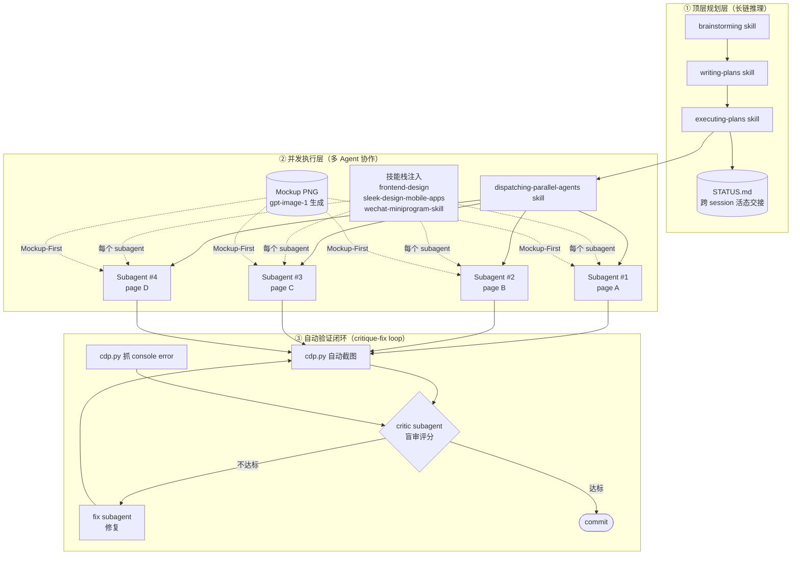

# Agent-Driven Mini-Program Showcase

> 用 Claude Code + 多 Agent 工作流，一人在两周内完成原本需要 4–6 人月的全栈交付。
> 本仓库是 [Campus_Trade](#) 项目（私有）的脱敏切片，专门用来展示「三层 Agent 编排」工作流。

---

## TL;DR

| 维度 | 数据 |
|---|---|
| 项目 | 校园二手交易微信小程序（软件工程课程设计，GB/T 8567-2006 规范交付） |
| 团队 | 1 人前端 + 文档（Claude Code 驱动），1 人后端（Codex CLI 驱动） |
| 规模 | 18 页前端 + 5 组件 + 11 业务域 API + 4 份设计报告（含 15 图、84 表） |
| 自研工具 | `cdp.py`（220 行）走 Chrome DevTools Protocol，自动截图 + console 抓取 |
| Mockup 资产 | gpt-image-1 预生成 34 张页面 mockup PNG |
| Agent 工作流 | 顶层 Plan agent + 并发执行 subagent + critic/fixer 闭环 三层编排 |

---

## 三层 Agent 编排架构



**关键工程设计**：
- **每批 ≤ 4 页**：避免 subagent 上下文溢出，跨批之间用 `doc/STATUS.md` 做活态交接。
- **Mockup-First**：先用 `gpt-image-1` 生成所有页面的 PNG mockup，subagent 拿到 PNG 后才动 wxml/wxss——把"视觉设计"从"代码实现"分离，subagent 不需要审美决策。
- **token-driven 设计系统**：`design/tokens.yaml` 是唯一视觉真源，CLAUDE.md 用 grep 命令强制 lint，subagent 写裸 hex/px 立刻被发现。
- **盲审隔离**：让独立的 critic subagent 评分，而不是让写代码的 subagent 自评——消除"自看自评"的认知盲点。

---

## 仓库导航

| 路径 | 用途 |
|---|---|
| **[CLAUDE.md](CLAUDE.md)** | Claude Code 的项目指令书。Agent 进入仓库后第一时间读这个 |
| **[docs/STATUS.md](docs/STATUS.md)** | 多 session 活态交接日志，Phase 进度、已踩坑、下一步 |
| **[docs/frontend_ui_plan.md](docs/frontend_ui_plan.md)** | 完整的 Phase 1–7 / 批次 B1–B7 多阶段执行计划 |
| **[docs/onboarding_backend.md](docs/onboarding_backend.md)** | 给同事（Codex CLI 用户）的后端开工包，体现跨工具协作 |
| **[scripts/cdp.py](scripts/cdp.py)** | 220 行自研 CDP 自动验证脚本（核心证据） |
| **[scripts/cdp_shot.py](scripts/cdp_shot.py)** | CDP 截图辅助脚本 |
| **[mockups/](mockups/)** | gpt-image-1 生成的代表性 mockup PNG（共 34 张原始资产，本仓收录 4 张） |
| **[transcripts/plan-mockup-first-workflow.md](transcripts/plan-mockup-first-workflow.md)** | 真实 Plan agent 输出——「Mockup-First 工作流」完整 plan |
| **[transcripts/subagent-batch-dispatch-sample.md](transcripts/subagent-batch-dispatch-sample.md)** | 真实 subagent 分发记录 |
| **[frontend-snippets/design/tokens.yaml](frontend-snippets/design/tokens.yaml)** | token-driven 设计系统的唯一视觉真源 |
| **[frontend-snippets/design/pages.yaml](frontend-snippets/design/pages.yaml)** | 每页的 UX 规约 + 禁用组件清单（subagent 实施前必读） |
| **[frontend-snippets/pages/](frontend-snippets/pages/)** | 代表性页面实现：auth / index / goods 三组 |

---

## cdp.py 的设计要点

`scripts/cdp.py` 走 **Chrome DevTools Protocol** 的 browser-level WebSocket 加 `Target.attachToTarget(flatten=true)`，绕过 chrome-devtools-mcp / puppeteer 在微信开发者工具上的兼容问题。它能：

```bash
# 列出当前 DevTools 暴露的所有 target
python scripts/cdp.py list

# 截图（可指定渲染层 / appservice 层 / 主进程）
python scripts/cdp.py screenshot --target render --output shot.png

# 收集 console 输出（用于 critic subagent 抓 error/warning）
python scripts/cdp.py console --target render --duration 5

# 远程触发任意 JS 表达式
python scripts/cdp.py eval "wx.getStorageSync('user')"

# 热重载
python scripts/cdp.py reload
```

**为什么这是关键证据**：传统 LLM 写前端最大的痛点是"看不到自己写的页面"。`cdp.py` 让 critic subagent 在每次实现后**真的看到截图 + 拿到 console error**，是把"主 Agent 自己看自己"的盲点拆掉的物理基础。

---

## 横向复用

同一套"长链规划 + 并发执行 + critique 闭环"工作流被复用到三个其他项目：

| 项目类型 | 工作流复用点 |
|---|---|
| **VLA 农业机器人创业项目** | docx-skill 生成商业计划书、路演稿、简历等多模产物链，统一口径 |
| **学术期刊 LaTeX 自建 Skill** | critic/fixer subagent + 格式校验脚本 + hooks，从零搭建专用 skill |
| **数据挖掘课程大作业** | 多 subagent 数据清洗 + LLM 段审降 AIGC |

---

## License & 提示

- 本仓库为脱敏切片，仅用于展示 Agent 工作流，**不含完整可运行小程序**。
- 完整工程位于私有主仓库；如需评审访问，可申请 collaborator 权限。
- Built with [Claude Code](https://claude.ai/code).
